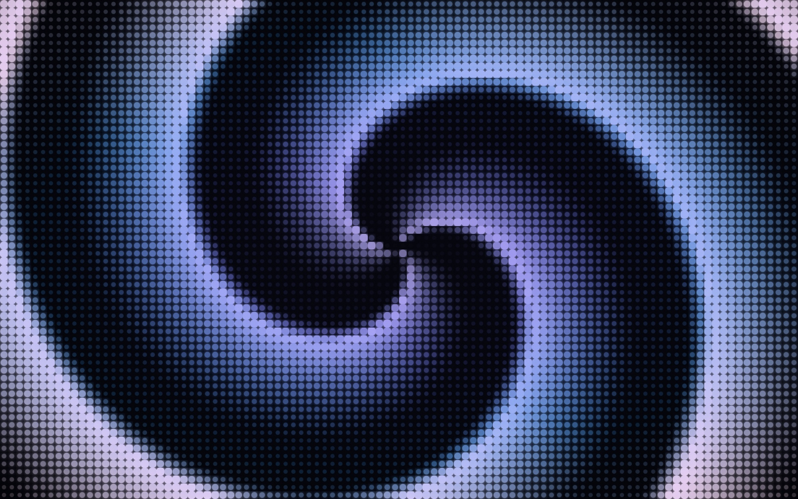
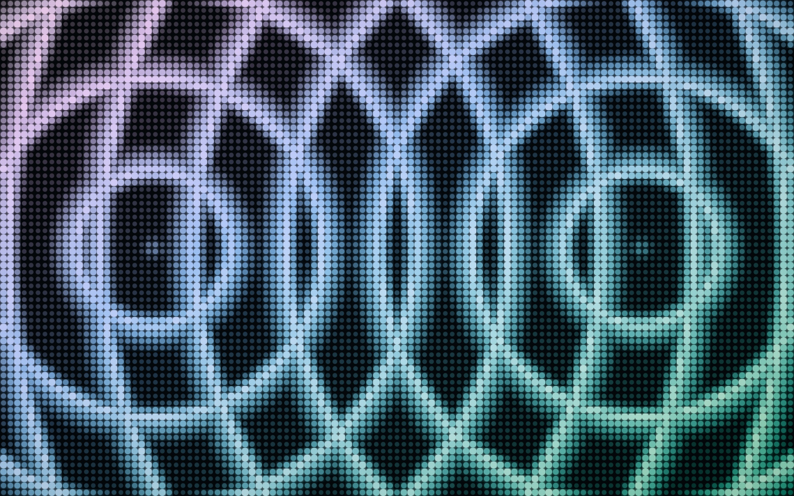
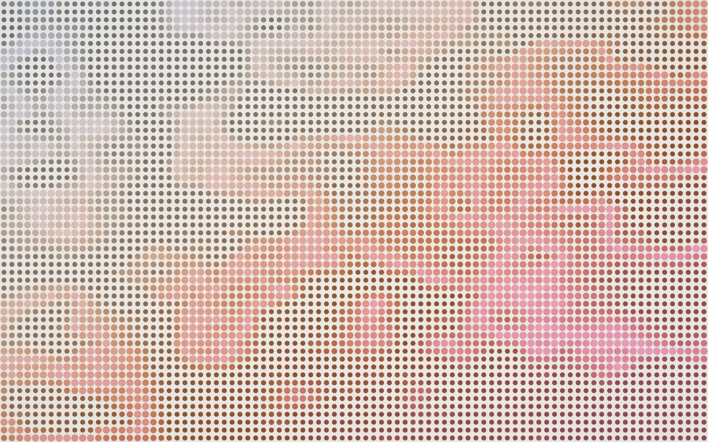
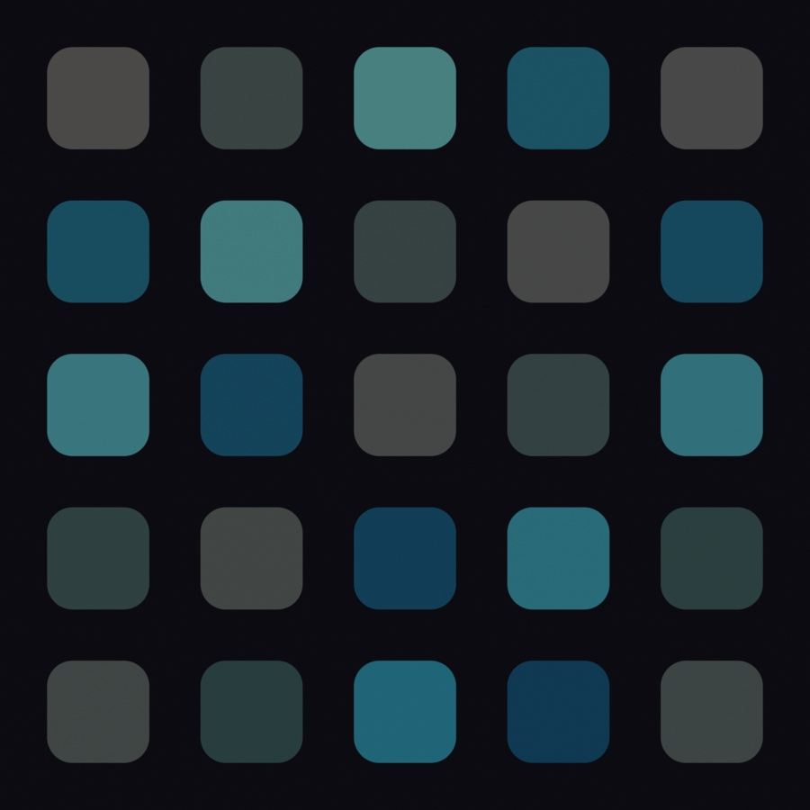
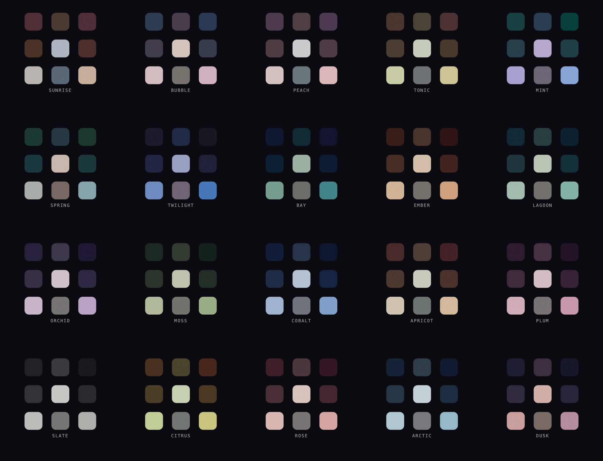
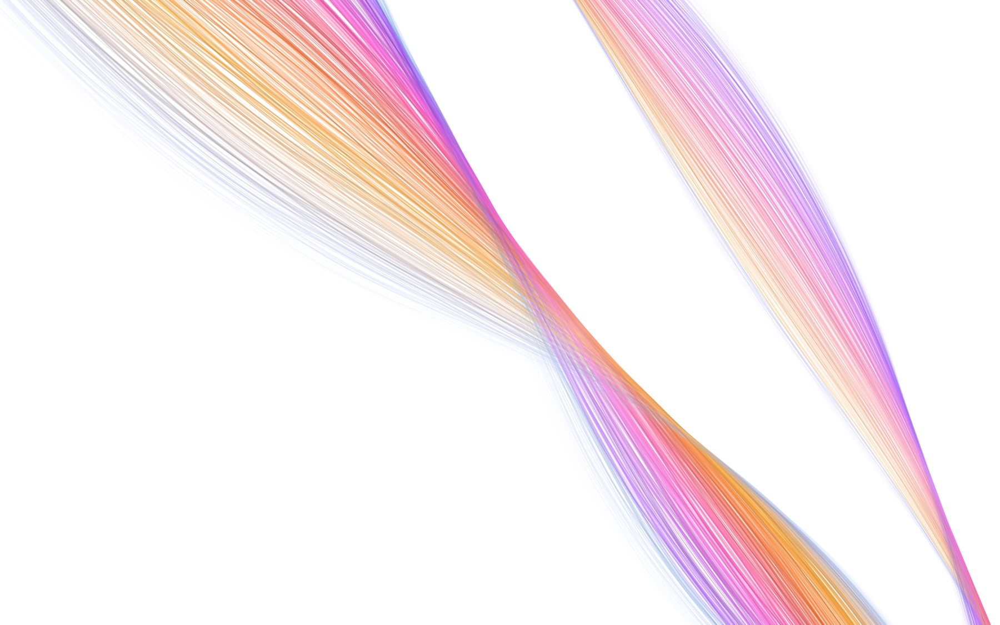
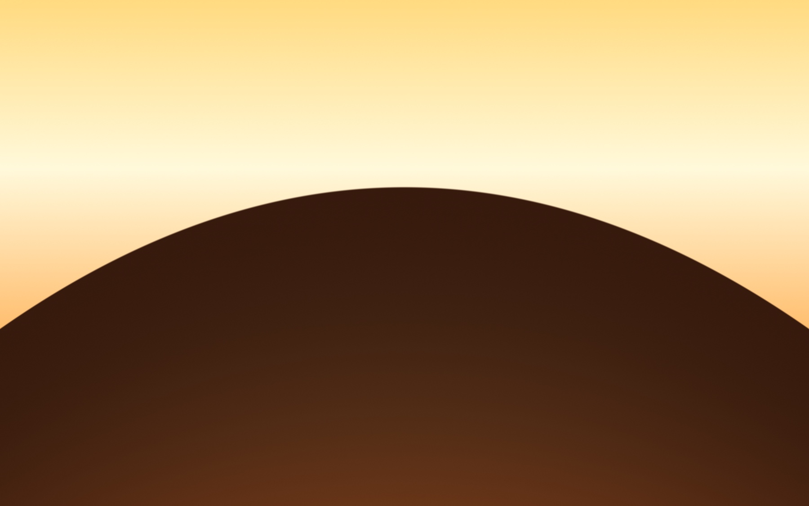
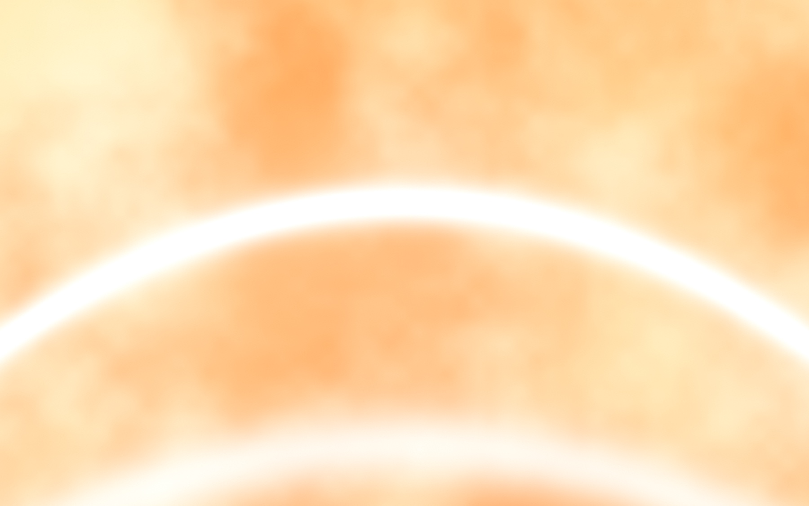
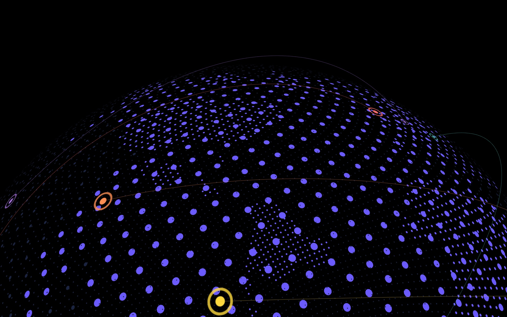
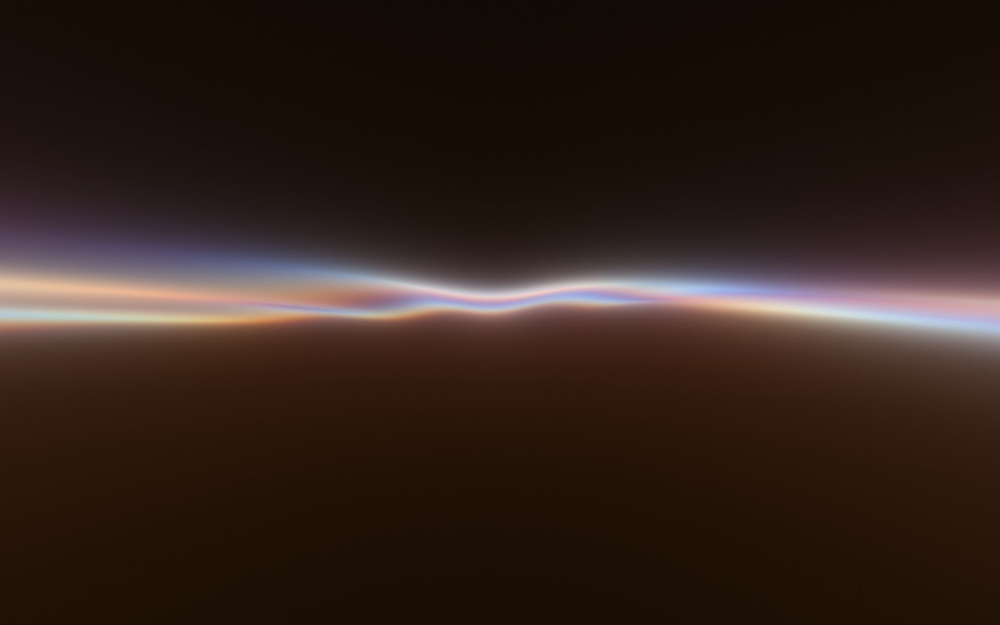

# VisualSim

A collection of self-contained generative visual simulators, built for making stills and loops rather than for shipping into a product.

Every simulator is a single HTML file.
There is no build step, no package manager and no framework.
Three.js and lil-gui load from a CDN, the visual is one fragment shader or one instanced mesh, and every parameter is exposed on a control panel you can open, drag and export.

## Quick start

```bash
git clone https://github.com/kevinxu-cmd/VisualSim.git
cd VisualSim
python3 -m http.server 8000
```

Then open `http://localhost:8000/<folder>/index.html`.

A local server is required because the simulators load Three.js over the network and several read their own canvas back for PNG and video export, which `file://` blocks.

## The simulators

| | Simulator | Path | What it is |
|---|---|---|---|
| 🌀 | [Gradient Spin](#gradient-spin) | `gradientSpin/` | A CSS loading spinner blown up into a full-screen wavefront field, plus a faithful spinner-scale fork |
| 🎗️ | [DataPulse](#datapulse) | `datapulse/` | Braided fiber bundles flowing between two nodes, as a tube or as a brushed-silk sheet |
| 📊 | [Pixel Bars](#pixel-bars) | `pixelBars/` | A pixel-art bar spectrum with a noise-blended palette and harmony accents |
| 🌅 | [Shader Gradient](#shader-gradient) | `shaderGradient/` | A four-stop gradient cut by hard-edge parabolic horizon arcs |
| 🌍 | [Particle Globe](#particle-globe) | `particleGlobe/` | A dotted globe with a procedural land mask and great-circle connection arcs |
| 🎽 | [Fluid Folds](#fluid-folds) | `fluidfolds/` | Domain-warped fractal noise shaded as folded liquid metal |
| 🌊 | [Wave Lights](#wave-lights) | `WaveLightsSim/` | Three interfering wave trains lit as a thin iridescent horizon |
| 🔷 | [Logomark Background Builder](#logomark-background-builder) | `EchoLogomarkVisual/` | A tiling logomark pattern over a configurable gradient, exported as PNG or WebP |

---

### Gradient Spin

Two forks of [BIAsia/gradient-spin](https://github.com/BIAsia/gradient-spin) pulling in opposite directions.
The original is a nine-cell CSS loading spinner where each cell's `animation-delay` comes from a distance function over the grid, so the distance function *is* the wavefront shape.

`gradientSpin/index.html` blows that idea up into a full-screen field.
The whole grid becomes one fragment shader, which removes the ceiling that shaped every decision upstream: cells are fragments instead of nodes, the wavefront is continuous rather than one fixed comet, and there are nine patterns instead of four.

<table>
<tr>
<td width="33%"></td>
<td width="33%"></td>
<td width="33%"></td>
</tr>
<tr>
<td width="33%" align="center"><sub>Aurora Spiral</sub></td>
<td width="33%" align="center"><sub>Silk Interference</sub></td>
<td width="33%" align="center"><sub>Dawn Drift</sub></td>
</tr>
</table>

`gradientSpin/index-spinner.html` stays at the scale the source actually runs at and reproduces its behavior line for line, drawn from signed distance fields so it stays crisp from a favicon to a wall.

<p align="center">
  
</p>

Both carry the same twenty palettes: the eight from the source verbatim, and twelve more each built on a named color relationship.
The spinner draws them all at once as a contact sheet.



Presets and palettes load from the URL.

```
gradientSpin/index.html?preset=Aurora%20Spiral
gradientSpin/index-spinner.html?palette=dusk&pattern=snake&size=4&layout=sheet
```

See [`gradientSpin/README.md`](gradientSpin/README.md) for the full write-up of what each fork changes and why.

---

### DataPulse

Two fiber bundles flow between a pair of nodes, each strand following its own noise-perturbed path along a shared centerline.

Each bundle draws as a **tube** or as a **sheet**.
The sheet gets a brushed-silk texture from per-strand luminance variation, a sheen that brightens where the surface turns edge-on toward the camera, and feathered outer strands.
Particles ride the centerline on top.

<table>
<tr>
<td width="50%"></td>
<td width="50%"></td>
</tr>
<tr>
<td width="50%" align="center"><sub>Tube layout, dark</sub></td>
<td width="50%" align="center"><sub>Tube layout, light</sub></td>
</tr>
</table>

The Stripe Ribbon preset uses the sheet layout with a width gradient across the bundle.

<table>
<tr>
<td width="50%"></td>
<td width="50%"></td>
</tr>
<tr>
<td width="50%" align="center"><sub>Stripe Ribbon</sub></td>
<td width="50%" align="center"><sub>Stripe Ribbon, wider color spread</sub></td>
</tr>
</table>

Presets load from the URL: `datapulse/index.html?preset=Stripe%20Ribbon`.

---

### Pixel Bars

The frame is split into a grid of cells.
Each column has a height in whole cells, and each filled cell picks its color from a four-stop palette by blending its vertical position with FBM noise, so the bars read as pixel art rather than as a gradient ramp.

A second noise field decides which cells take a pastel harmony accent, derived from the palette by color theory rather than picked by hand.

<table>
<tr>
<td width="50%"></td>
<td width="50%"></td>
</tr>
</table>

Two templates: **Wave**, a wide spectrum with bumpy heights across the full width, and **Slope**, a narrower mountain rising left to right.

<details>
<summary>Saved settings for the two frames above</summary>

```json
{"template":"wave","color1":"#0a1a36","color2":"#1f5a9c","color3":"#6ed8e8","color4":"#ffffff","cols":70,"rows":25,"colGap":0.025,"rowGap":0,"visualWidth":1,"visualXCenter":0.49,"visualHeight":0.875,"heightBase":0.135,"heightVariance":0.77,"heightTrend":0.26,"freqScale":3.6,"heightSeed":91.22077976852206,"noiseScale":0.71,"noiseAmount":0.4,"hueJitter":0.135,"topBoost":1,"topBoostRows":4.3,"topNarrow":0.605,"topRows":3.1,"widthJitter":0.635,"vertWidthVar":0.86,"vertWidthScale":2,"accentColor":"#f97bae","accentHarmony":"manual","accentPastel":0.67,"accentAmount":0.935,"accentDensity":0.63,"accentEdgeBias":0.91,"animateColors":true,"animateAccents":true,"animateHeights":false,"timeScale":0.645}
```

```json
{"template":"wave","color1":"#750000","color2":"#ff6a00","color3":"#ffb455","color4":"#ffffff","cols":70,"rows":25,"colGap":0.025,"rowGap":0,"visualWidth":1,"visualXCenter":0.49,"visualHeight":0.875,"heightBase":0.135,"heightVariance":0.77,"heightTrend":0.26,"freqScale":3.6,"heightSeed":91.22077976852206,"noiseScale":0.71,"noiseAmount":0.4,"hueJitter":0.135,"topBoost":1,"topBoostRows":4.3,"topNarrow":0.605,"topRows":3.1,"widthJitter":0.635,"vertWidthVar":0.86,"vertWidthScale":2,"accentColor":"#6ee6cd","accentHarmony":"manual","accentPastel":0.67,"accentAmount":1,"accentDensity":0.68,"accentEdgeBias":1,"animateColors":true,"animateAccents":true,"animateHeights":false,"timeScale":0.645}
```

</details>

---

### Shader Gradient

A smooth four-stop linear gradient, optionally modulated by FBM texture, with up to four parabolic arcs layered on top.
Each arc fills the region on one side of its curve with its own color rather than glowing, which gives a paper-cut horizon look.
Softness is per arc, so the same shader covers a hard cut and a diffuse band.

`index.html` is the paper-cut version.
`index-textured.html` keeps the same arcs but leaves the gradient's noise texture visible.

<table>
<tr>
<td width="33%"></td>
<td width="33%"></td>
<td width="33%"></td>
</tr>
<tr>
<td width="33%" align="center"><sub>Hard cut</sub></td>
<td width="33%" align="center"><sub>Softened</sub></td>
<td width="33%" align="center"><sub>Texture left visible</sub></td>
</tr>
</table>

<details>
<summary>Saved settings for the softened frame</summary>

These are the parameters behind the warm sunrise look above, for `index.html`.
That file has no paste control, so set them on the panel by hand.

```json
{"color1":"#ff8a3d","color2":"#ffb86a","color3":"#fff3d6","color4":"#ffd680","gradAngle":140,"textureAmount":0.19,"noiseScale":1.2,"speed":0.15,"contrast":1.05,"brightness":1,"grain":0.015,"streakCount":1,"s1color":"#ffffff","s1y":0.4,"s1c":0.215,"s1t":-0.49,"s1soft":0.015,"s1i":0.57,"s1falloff":0.84,"s1above":false,"s2color":"#ffd9a8","s2y":-0.1,"s2c":0.22,"s2t":0,"s2soft":0.005,"s2i":0.8,"s2falloff":0,"s2above":true,"s3color":"#ffffff","s3y":0.85,"s3c":-0.15,"s3t":0,"s3soft":0.002,"s3i":0.5,"s3falloff":0,"s3above":true,"s4color":"#ffffff","s4y":-0.4,"s4c":0.15,"s4t":0,"s4soft":0.002,"s4i":0.45,"s4falloff":0,"s4above":true}
```

</details>

---

### Particle Globe

A globe drawn as a field of points, with land derived from a procedural mask rather than a texture.
Each region is an elliptical gaussian blob in latitude and longitude space, and negative weights carve out the inland seas, so the Mediterranean, Hudson Bay and the Caspian read as water without any bitmap.

Great-circle arcs connect configurable endpoint pairs, each with its own color and a ringed marker where it lands.

<table>
<tr>
<td width="50%"></td>
<td width="50%"></td>
</tr>
</table>

---

### Fluid Folds

Domain-warped fractal noise, shaded as folded liquid metal.
Motion and fractal detail are the only two control groups, because everything else in the look falls out of the warp.


---

### Wave Lights

Three wave trains, one along X, one along Z and one diagonal, summed and lit so their interference pattern reads as a thin iridescent horizon rather than as a surface.



---

### Logomark Background Builder

A tiling logomark pattern over a configurable gradient, with controls for icon size, spacing, rotation, row stagger and per-stop gradient colors.
Exports PNG or WebP.


---

## Controls

Every simulator except the Logomark Background Builder puts its parameters on a [lil-gui](https://lil-gui.georgealways.com/) panel in the top right.
Click the panel title to collapse it out of a screenshot.

What each one can export:

| Simulator | Copy / paste settings | Save PNG | Record MP4 | URL parameters |
|---|:---:|:---:|:---:|---|
| Gradient Spin (field) | ✅ | ✅ | ✅ | `?preset=` |
| Gradient Spin (spinner) | ✅ | ✅ | ✅ | `?palette=` `?pattern=` `?size=` `?layout=` |
| DataPulse | ✅ | | ✅ | `?preset=` |
| Pixel Bars | ✅ | | | |
| Particle Globe | ✅ | | | |
| Shader Gradient (arcs) | | | | |
| Shader Gradient (textured) | ✅ | | | |
| Fluid Folds | | ✅ | | |
| Wave Lights | | | | |
| Logomark Background Builder | copies and pastes CSS, not settings | ✅ (and WebP) | | |

Settings copy and paste move a single JSON blob, so a look you like is one clipboard round trip away from being reproducible.
Everywhere except the textured Shader Gradient, both fall back to a `prompt()` dialog when the Clipboard API is blocked, which it is in most embedded webviews.

Both Gradient Spin forks honor `prefers-reduced-motion` and start paused on a static mid-sweep frame.

## Repository layout

```
datapulse/            index.html
EchoLogomarkVisual/   logomark-bg-builder.html
fluidfolds/           index.html
gradientSpin/         index.html, index-spinner.html, README.md
particleGlobe/        index.html
pixelBars/            index.html
shaderGradient/       index.html, index-textured.html
WaveLightsSim/        index.html
docs/                 screenshots used by this README
```

## Credits

Gradient Spin is a fork of [BIAsia/gradient-spin](https://github.com/BIAsia/gradient-spin), MIT licensed.
Everything else is original work in this repository.

Built on [Three.js](https://threejs.org/) and [lil-gui](https://lil-gui.georgealways.com/).
